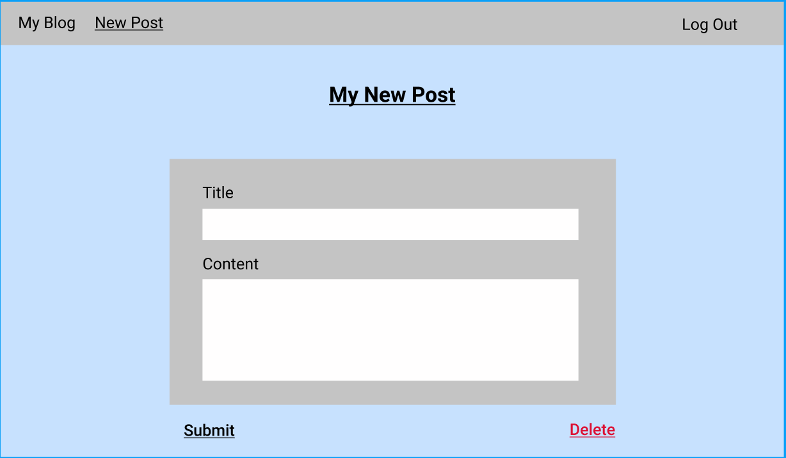
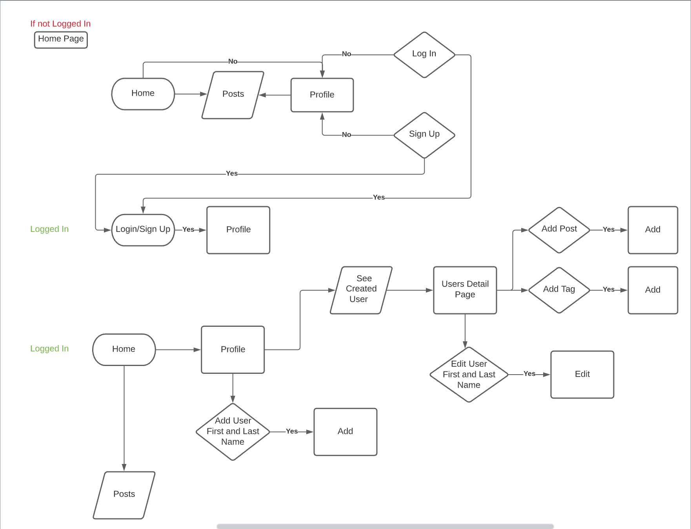

# Super-Glow-Blog

About this project:

This is superhero/villains Blog where you can find cool blogs from your favorite, or maybe not, DC Universe characters. Also, you can be part of it by registering your User and start creating your own blogs with any character you would like. In this Blog you can write a post, attach a tag to your post as well as edit a character that you choose, delete this character or create a new one. Enjoy using using this app with creating many great, Super Posts!!! 

Technologies used: Flask, SQLAlchemy, Jinja2, CSS, PostgreSQL 12.

Istallation steps: pip install Flask Flask-SQLAlchemy psycopg2, Flask-Login

WireFrame:

ERD: 

Future Goals:
1. Create functionality for users to write comments, edit them and delete.
2. Create functionality to delete account. 
3. Create functionality for users to share their posts.
4. Create functionality for users to attach images to their posts.
